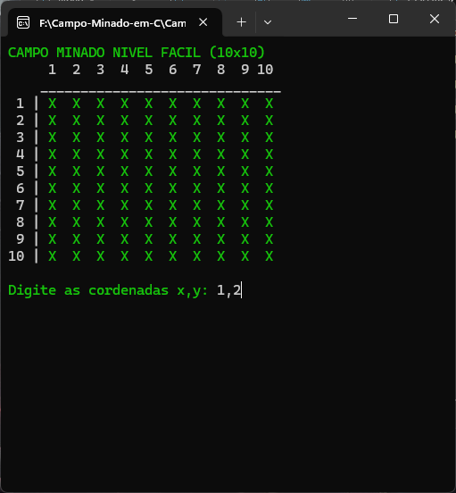
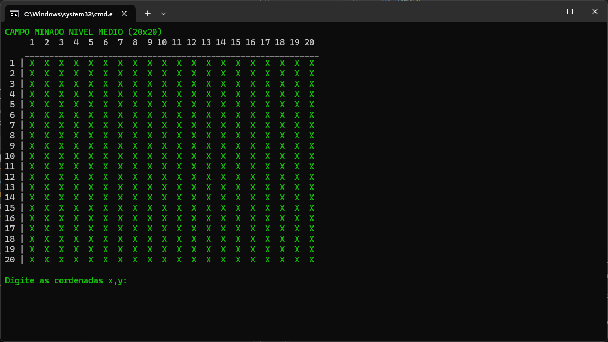
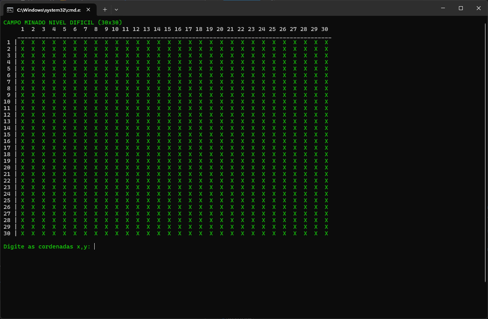

## Olá galera, como vão? 🖖🏽😊
Bem-vindos ao campo minado interativo em C! 💣💥

### Objetivo!
O que você verá por aqui?? Então, o objetivo era fazer um campo minado interativo em C e empregar os conceitos de alocação dinâmica de matrizes construídas como vetor de
ponteiros.

### Descrição do Jogo!
- O usuário deve escolher o nivel do jogo se baseando nas seguintes propriedades:
    a) Fácil: um campo minado de 10x10 com 3 minas;
    b) Médio: um campo minado de 20x20 com 6 minas;
    c) Difícil: um campo minado de 30x30 com 9 minas;
  
- Após a interação com o menu o usuário segue o inicio do jogo, visualizando o campo com a dificiculdade escolhida e digitando as coordenadas no formato: x,y
- O jogo segue até o fim, com o jogador ganhando ou perdendo ele tem a chance de escolher se deve tentar novamente ou não.

### Regras técnicas
- As coordenadas escolhidas pelo usuário começam com 1 até o tamanho máximo da
matriz.
- Verificar coordenadas repetidas ou coordenadas que não existem.
- O jogador perde se ele(a) escolher uma coordenada com um mina, nesse caso a
mensagem “game over” deve ser impressa na tela seguida da matriz original mostrando
todos os valores sem os ‘x’.

## Mídias do Projeto!
### Nível Fácil

### Nível Médio

### Nível Difícil


## Como executar!

Primeiramente, verifique se o seu computador tem o compilador GCC instalado.
Caso não tenha, siga as dicas abaixo, no terminal do seu computador 👇🏽.

```bash

# •	Windows
$ wsl --install
$ sudo apt update
$ sudo apt install gcc

# •	Linux (Ubuntu/Debian)
$ sudo apt update
$ sudo apt install gcc

```
para executar o programa siga os comandos entre na pasta do projeto Campo-Minado-em-C e abra a pasta Campo-minado, e rode o comando abaixo no seu terminal 👇🏽

```bash

$ gcc -o campo_minado campo_minado_luanedossantoslopes.c
$ ./campo_minado

```

##
<div align='center'>   
Criado por Luane dos Santos, aluna de Engenharia de Software na <a href="https://icomp.ufam.edu.br/">UFAM</a>, Profº  <a href="https://www.linkedin.com/in/juan-colonna-700bba56">Juan Colonna</a> da disciplina Algoritmos e Estrutura de Dados I.
</div>
